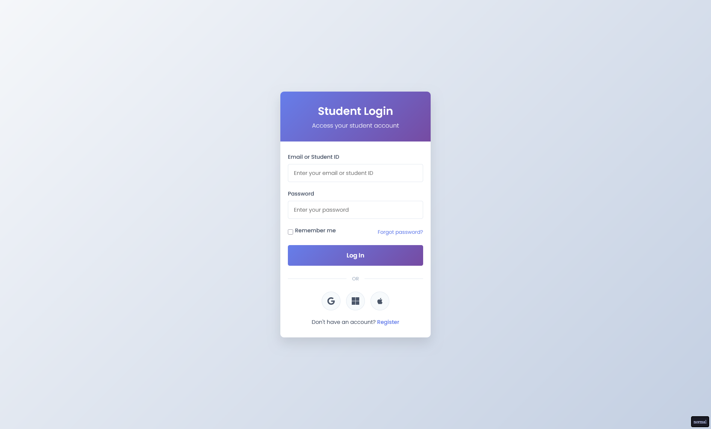

# Использование адаптивной верстки

## Срок сдачи работ

Последний коммит и пул реквест должен быть оформлен до ???

## Цель:

Разработать функциональную форму

### Логин

_Является станадртной страницей, которая будет открываться (`index.html`)_

    

### Регистрация

_Можно перейти с логина через якорь_

    

### Резет CSS

Подключите [данный](https://gist.githubusercontent.com/ktkv419/c8840dfcbcff24248c20f4199108b28e/raw/a4aac6b59c95922023a26177bac72aaeffc4cbec/reset.css) CSS файл перед подключением вашего для нормализации правил CSS

### Шрифты

- Poppins

### Цвета

#### Акцентные

- #667eea (он же rgba(102, 126, 234, 0.15))
- #764ba2

#### Задники

- #f5f7fa
- #c3cfe2
- #4a5568

### Функционал

- Формы должны отправлять POST запрос с полями

Логин:
- email
- password
- remember

_На адрес `/api/login`_

Регистрация:
- fullname
- email
- student-id
- program
- password
- terms

_На адрес `/api/register`_

Внутри дропдаун меню должны быть пункты:

- Computer Science
- Engineering
- Business
- Arts & Humanities
- Science

### Псевдосостояния

#### Ввод 

    

#### Кнопка

_Поднимается чутка вверх (`transform: translate()`) и появляется тень

    

#### Ссылка

    

### Медиа

Для логина через сторонние сервисы используйте картинки в формате `svg`

## Как сдавать

1. Создайте форк репозитория в организации `21ISR` с названием `uidev-lab9-вашафамилия`
2. Используя ветку `wip` оформите необходимые файлы
3. Зафиксируйте изменения в вашем репозитории
4. Когда документ будет готов - создайте пул реквест из ветки `wip` (вашей) на ветку `main` (тоже вашу) и укажите меня ([ktkv419](https://github.com/ktkv419)) как reviewer

**Не мержите сами коммит**, это сделаю я после проверки задания
